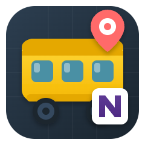
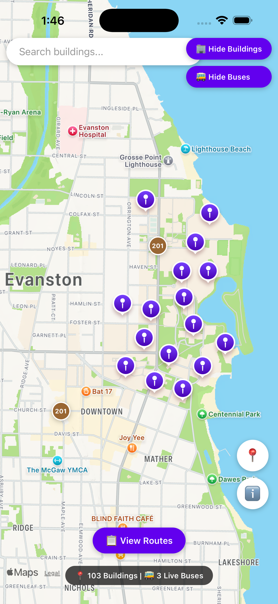
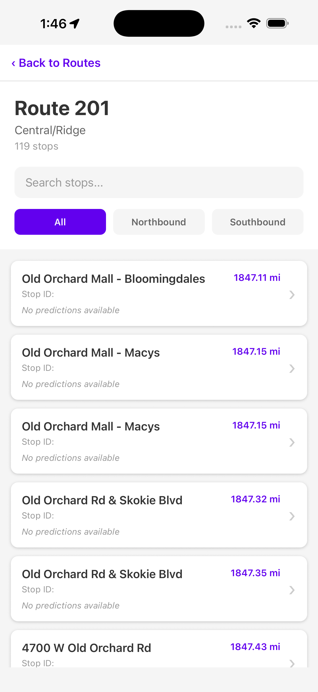
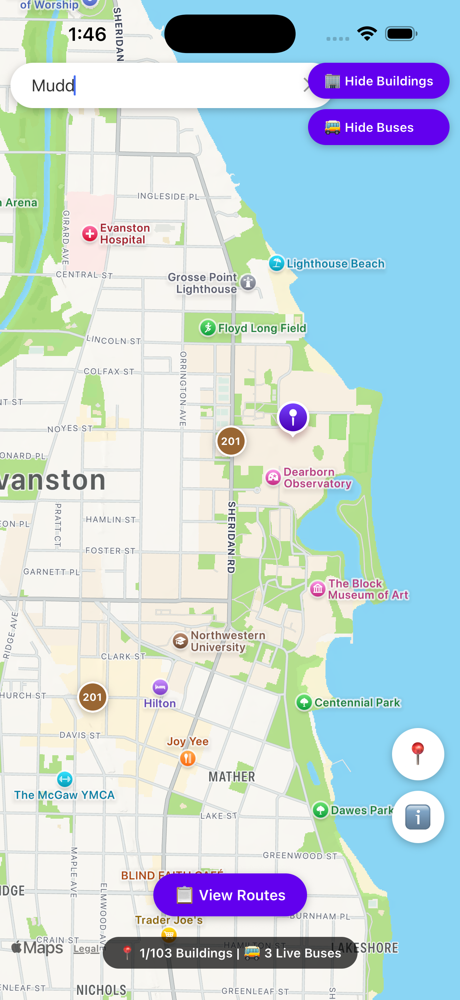
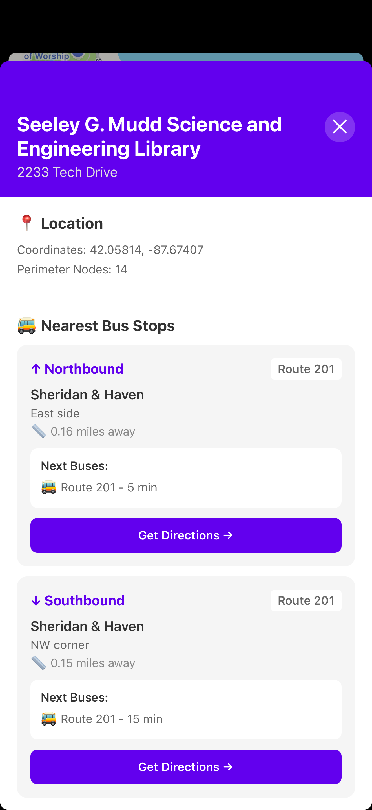

# Northwestern Bus Finder

<p align="center">
  
</p>

A comprehensive multi-platform application for Northwestern University students and visitors to find buildings, track live CTA buses, and get real-time bus arrival predictions.

## Overview

<p align="center">
  
  
</p>
<p align="center">
  
  
</p>

This project consists of three integrated components:
1. **C++ CLI Tool**: Command-line interface for querying OSM building data and CTA bus stops
2. **Python FastAPI Backend**: RESTful API server that bridges the C++ engine with the mobile app
3. **React Native Mobile App**: Cross-platform mobile application with interactive maps and live bus tracking

## Features

### 🏢 Building Discovery
- **Interactive Map**: View all Northwestern campus buildings with precise locations
- **Search Buildings**: Quickly find buildings by name with real-time search
- **Building Details**: Access detailed information including:
  - Building address and coordinates
  - Nearest bus stops (Northbound & Southbound)
  - Live bus arrival predictions
  - Walking distance to nearest stops
  - Direct navigation to bus stops via Apple/Google Maps

### 🚌 Live Bus Tracking
- **Real-Time Bus Locations**: Track all CTA buses on campus routes (201, 205, 208, 213)
- **Color-Coded Routes**: Easily identify buses by their route colors
  - Route 201: Brown (#996633)
  - Route 205: Red (#DC143C)
  - Route 208: Blue (#1E90FF)
  - Route 213: Green (#228B22)
- **Bus Information**: Tap any bus to see:
  - Route number and destination
  - Current heading
  - Show/hide all stops for that route
- **Live Updates**: Bus positions refresh every 10 seconds

### 🚏 Bus Stop Information
- **Route Stops Visualization**: Display all stops for a selected bus route on the map
- **Stops List View**: Browse all stops by route with:
  - Live arrival predictions
  - Distance from your location
  - Direction filters (Northbound/Southbound/All)
  - Search functionality
- **Nearest Stops**: Automatic detection of closest stops based on your location

### 🗺️ Navigation & Directions
- **Turn-by-Turn Directions**: Open Apple Maps or Google Maps for walking directions
- **Center on Location**: Quick button to center map on your current position
- **Search & Filter**: Search buildings and filter by various criteria

## Architecture

```
┌─────────────────────────────────────────────────────────────┐
│                     Mobile App (React Native)                │
│                                                               │
│  - Interactive Map with Markers                              │
│  - Real-time Bus Tracking                                    │
│  - Building Search & Details                                 │
│  - Navigation Integration                                    │
└───────────────────────────┬─────────────────────────────────┘
                            │
                    REST API (HTTP)
                            │
┌───────────────────────────┴─────────────────────────────────┐
│                   FastAPI Backend (Python)                   │
│                                                               │
│  - RESTful API Endpoints                                     │
│  - CTA Bus Tracker Integration                               │
│  - Route Geometry Generation                                 │
└───────────┬───────────────────────────┬─────────────────────┘
            │                           │
    ┌───────┴────────┐         ┌────────┴────────┐
    │  C++ Engine    │         │   CTA API       │
    │                │         │                 │
    │ - OSM Building │         │ - Live Buses    │
    │   Data Parser  │         │ - Bus Stops     │
    │ - Spatial      │         │ - Predictions   │
    │   Queries      │         │ - Routes        │
    └────────────────┘         └─────────────────┘
```

## Tech Stack

### Mobile App
- React Native with Expo
- React Navigation for screen transitions
- react-native-maps for interactive maps
- Custom hooks for data fetching and state management

### Backend API
- FastAPI (Python) - High-performance REST API
- Uvicorn - ASGI server
- Pydantic - Data validation
- CORS enabled for mobile app communication

### C++ Engine
- TinyXML2 for OSM XML parsing
- nlohmann/json for JSON output
- Efficient spatial queries for buildings
- Haversine distance calculations

### External APIs
- CTA Bus Tracker API - Real-time bus data
- Apple Maps / Google Maps - Navigation

## Prerequisites

### For C++ CLI Tool
- g++ with C++17 support
- libcurl (if fetching CTA JSON live)
- Make

### For Backend API
- Python 3.8+
- pip (Python package manager)

### For Mobile App
- Node.js (v14 or higher)
- npm or yarn
- Expo CLI: `npm install -g expo-cli`
- iOS Simulator (Mac) or Android Emulator

### API Keys
- CTA Bus Tracker API Key 

## Installation

### 1. Clone the Repository
```bash
git clone <your-repo-url>
cd osmbuildingfinder
```

### 2. Build C++ Engine
```bash
# Build the building finder executable
make

# This creates the 'json_api' executable
```

### 3. Setup Python Backend
```bash
# Create virtual environment
python3 -m venv venv
source venv/bin/activate  # On Windows: venv\Scripts\activate

# Install dependencies
cd api
pip install -r requirements.txt
```

### 4. Setup Mobile App
```bash
cd mobile
npm install
```

## Running the Application

### Option 1: Full Stack (Mobile App + API)

#### Step 1: Start the Backend API
```bash
# From project root
source venv/bin/activate
cd api
python main.py
```

The API will start on `http://localhost:8080`

#### Step 2: Start the Mobile App
```bash
# From project root
cd mobile
npx expo start
```

Then press:
- `i` for iOS Simulator
- `a` for Android Emulator
- Scan QR code with Expo Go app on physical device

#### Step 3: Configure for Your Device

**For iOS Simulator:**
The default configuration (`http://localhost:8080`) works out of the box.

**For Android Emulator:**
Update [mobile/src/constants/config.js](mobile/src/constants/config.js):
```javascript
BASE_URL: 'http://10.0.2.2:8080/api'
```

**For Physical Device:**
1. Find your computer's IP address:
   - Mac: `ifconfig | grep "inet "`
   - Windows: `ipconfig`
2. Update [mobile/src/constants/config.js](mobile/src/constants/config.js):
```javascript
BASE_URL: 'http://YOUR_IP_ADDRESS:8080/api'
```
3. Ensure both devices are on the same WiFi network

### Option 2: C++ CLI Tool Only

```bash
# Build the CLI tool
make

# Run interactive session
./a.out
```

#### Example CLI Session
```
$ ./a.out
** NU open street map **

Enter map filename> data/map.osm

# of nodes: 15070
# of buildings: 103
# of bus stops: 12

Enter building name (partial or complete), or * to list, or @ for bus stops, or $ to end> Mudd
Seeley G. Mudd Science and Engineering Library
Address: 2233 Tech Drive
Building ID: 42703541
# perimeter nodes: 14
Location: (42.0581, -87.6741)
Closest southbound bus stop:
  18357: Sheridan & Haven, bus #201, NW corner, 0.154706 miles
Closest northbound bus stop:
  18355: Sheridan & Haven, bus #201, East side, 0.155197 miles
```

## API Documentation

### Base URL
- Development: `http://localhost:8080/api`
- Production: `https://your-app.fly.dev/api`

### Endpoints

#### Buildings
- `GET /api/buildings` - Get all buildings
- `GET /api/buildings/search?q=query` - Search buildings by name
- `GET /api/buildings/{id}` - Get building details with nearest stops

#### Bus Stops
- `GET /api/bus-stops` - Get all bus stops near Northwestern
- `GET /api/bus-stops/{stop_id}/predictions` - Get predictions for specific stop
- `GET /api/bus-stops/nearest?lat={lat}&lon={lon}` - Find nearest stops to location

#### Routes
- `GET /api/routes` - Get all CTA routes near Northwestern
- `GET /api/routes/{route_id}/buses` - Get live buses for specific route
- `GET /api/routes/{route_id}/geometry` - Get route geometry (stop coordinates)

#### Live Buses
- `GET /api/buses/live` - Get all live buses on NU-area routes

#### Health Check
- `GET /` - API health check and status

### Example Response

**GET /api/buildings/search?q=tech**
```json
[
  {
    "id": 42703541,
    "name": "Technological Institute",
    "address": "2145 Sheridan Rd",
    "lat": 42.0581,
    "lon": -87.6741,
    "node_count": 14
  }
]
```

## Project Structure

```
osmbuildingfinder/
├── README.md
├── makefile                    # Build C++ components
│
├── src/                        # C++ Source Code
│   ├── building.cpp/h          # Building data structures
│   ├── json_api.cpp            # JSON API generator
│   ├── osm.cpp/h               # OSM data parser
│   └── ...
│
├── include/                    # C++ Headers
│   ├── json.hpp                # nlohmann/json
│   └── tinyxml2.h/cpp          # XML parser
│
├── api/                        # Python FastAPI Backend
│   ├── main.py                 # Main API application
│   ├── models.py               # Pydantic data models
│   ├── cta_service.py          # CTA API integration
│   ├── cpp_bridge.py           # C++ to Python bridge
│   ├── route_geometry.py       # Route path generation
│   └── requirements.txt        # Python dependencies
│
├── mobile/                     # React Native Mobile App
│   ├── App.js                  # App entry point
│   ├── package.json            # Node dependencies
│   │
│   └── src/
│       ├── navigation/         # Navigation configuration
│       │   └── AppNavigator.js
│       │
│       ├── screens/            # App screens
│       │   ├── MapScreen.js    # Main map view
│       │   ├── BuildingDetailModal.js
│       │   ├── RoutesListScreen.js
│       │   ├── StopsListScreen.js
│       │   └── StopDetailModal.js
│       │
│       ├── components/         # Reusable components
│       │   ├── BusMarker.js    # Bus map markers
│       │   ├── BuildingMarker.js
│       │   ├── StopCard.js
│       │   └── RouteCard.js
│       │
│       ├── hooks/              # Custom React hooks
│       │   ├── useLocation.js  # Location tracking
│       │   ├── useBuildings.js # Building data
│       │   ├── useBusStops.js  # Bus stops data
│       │   └── useLiveBuses.js # Live bus tracking
│       │
│       ├── services/           # API services
│       │   └── api.js          # API client
│       │
│       ├── constants/          # App constants
│       │   └── config.js       # Configuration
│       │
│       └── utils/              # Utility functions
│           └── distance.js     # Distance calculations
│
└── data/                       # OSM data files
    └── map.osm
```

## Configuration

### API Configuration ([api/main.py](api/main.py))
- `CTA_API_KEY`: CTA Bus Tracker API key
- `nu_routes`: List of routes near Northwestern (201, 205, 208, 213)

### Mobile Configuration ([mobile/src/constants/config.js](mobile/src/constants/config.js))
- `BASE_URL`: Backend API URL
- `NU_CAMPUS_CENTER`: Map initial center coordinates
  - latitude: 42.0558
  - longitude: -87.6751
- `BUS_UPDATE_INTERVAL`: How often to refresh bus positions (10000ms = 10 seconds)

## Mobile App Features

### Map Screen
- Interactive map with pan, zoom, and rotation
- Building markers (purple pins)
- Live bus markers (color-coded by route)
- Stop markers (purple circles) when viewing a route
- Search bar for filtering buildings
- Toggle controls to show/hide buildings and buses
- Legend showing route colors
- Info badge with building/bus counts
- Floating action buttons for centering on location and showing legend

### Building Detail Modal
- Building name, address, and coordinates
- Number of perimeter nodes
- Nearest northbound and southbound stops
- Live arrival predictions for each stop
- Distance to stops
- "Get Directions" button (opens Maps app)
- "Close" button to return to map

### Routes List Screen
- All CTA routes near Northwestern
- Route numbers, names, and colors
- Count of active buses on each route
- Tap to view stops for that route

### Stops List Screen
- All stops for selected route
- Search by stop name
- Filter by direction (All/Northbound/Southbound)
- Live arrival predictions
- Distance from current location
- Sorted by proximity
- Pull to refresh

### Stop Detail Modal
- Stop name and location
- Live bus predictions
- Nearby buildings
- Navigation options

## Development

### Adding New Features

**To add a new API endpoint:**
1. Define the endpoint in [api/main.py](api/main.py)
2. Add corresponding service methods in [api/cta_service.py](api/cta_service.py)
3. Update data models in [api/models.py](api/models.py)

**To add a new screen:**
1. Create screen component in `mobile/src/screens/`
2. Register in [mobile/src/navigation/AppNavigator.js](mobile/src/navigation/AppNavigator.js)
3. Add navigation calls from existing screens

**To add a new hook:**
1. Create hook file in `mobile/src/hooks/`
2. Follow pattern: fetch data, handle loading/error states
3. Import and use in components

### Debugging

**Backend logs:**
```bash
# API logs appear in terminal where you ran main.py
# Shows request logs, errors, and API responses
```

**Mobile logs:**
```bash
# In Expo terminal, press:
# Shift + M - Open React Native DevTools
# J - Open Chrome DevTools
```

**C++ debugging:**
```bash
# Compile with debug symbols
g++ -g -std=c++17 src/*.cpp include/tinyxml2.cpp -o debug_build

# Run with gdb
gdb ./debug_build
```

## Deployment

### Backend Deployment (Fly.io)

```bash
# Install Fly CLI
curl -L https://fly.io/install.sh | sh

# Login
fly auth login

# Deploy
cd api
fly launch
fly deploy
```

Update [mobile/src/constants/config.js](mobile/src/constants/config.js) with production URL:
```javascript
BASE_URL: 'https://your-app.fly.dev/api'
```

### Mobile App Deployment

**iOS:**
```bash
cd mobile
eas build --platform ios
eas submit --platform ios
```

**Android:**
```bash
cd mobile
eas build --platform android
eas submit --platform android
```

Follow [Expo EAS documentation](https://docs.expo.dev/build/introduction/) for detailed app store submission.

## Troubleshooting

### "Cannot connect to API"
- Ensure backend is running on port 8080
- Check `BASE_URL` in [mobile/src/constants/config.js](mobile/src/constants/config.js)
- Verify devices are on same network (for physical devices)
- Check firewall settings

### "No buses showing"
- CTA buses only show when actively running
- Routes 205, 208, 213 may have limited service
- Check CTA service schedules
- Verify CTA API key is valid

### "Location permission denied"
- Grant location permissions in device settings
- iOS: Settings → Privacy → Location Services → Expo Go
- Android: Settings → Apps → Expo Go → Permissions → Location
- Restart the app after granting permissions

### "Building data not loading"
- Ensure C++ executable (`json_api`) was built successfully
- Check that `map.osm` exists in data directory
- Verify backend can execute `../json_api`
- Check file permissions: `chmod +x json_api`

### "Duplicate key errors in React"
- Already fixed in latest version
- Keys use format: `${stop.id}-${stop.route}-${stop.direction}`
- Ensure you're running the latest code

### "Route stops not appearing"
- Tap a bus marker first
- Click "Show Stops" in the bus info card
- Ensure stop data is loading (check API logs)

## Performance Optimization

### Backend
- Building data is cached after first load
- CTA API responses are cached for performance
- Route geometry is computed once and cached

### Mobile App
- Bus positions update every 10 seconds (configurable)
- Map markers are efficiently rendered
- FlatLists use optimized rendering for large lists
- Images and assets are optimized for mobile

## Testing

### Backend Testing
```bash
# Test endpoints with curl
curl http://localhost:8080/
curl http://localhost:8080/api/buildings
curl http://localhost:8080/api/buses/live
```

### Mobile Testing
- Test on both iOS and Android simulators
- Test on physical devices
- Test different screen sizes
- Test with poor network conditions
- Test location permissions on/off

## Contributing

1. Fork the repository
2. Create a feature branch: `git checkout -b feature-name`
3. Commit changes: `git commit -am 'Add feature'`
4. Push to branch: `git push origin feature-name`
5. Submit a pull request


## Acknowledgments

- **OpenStreetMap** for building data
- **CTA Bus Tracker API** for real-time transit data
- **Northwestern University** for campus location data
- **React Native** and **Expo** communities
- **TinyXML2** and **nlohmann/json** libraries
---

**Built with ❤️ for Northwestern University**
